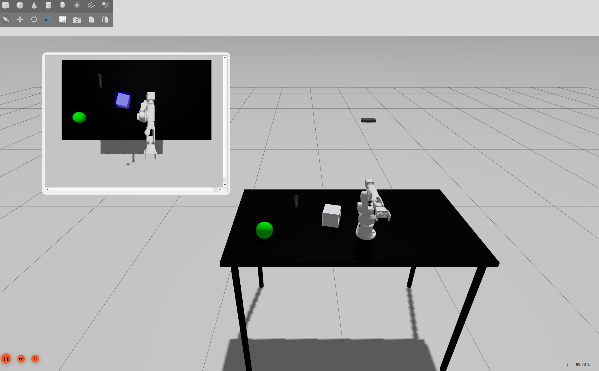

# Robot Arm Manipulator Environment

ROS2 packages for simulating a 6-axis robot arm (modified version of an [open-source hardware design by tw2ka](https://www.dropbox.com/scl/fi/mgowac0a7bwx7u2pcz12b/Arduino-robot-arm-files-step.zip?rlkey=3cpy6x4wcpfr1s548s7qxxex5&e=2&dl=0) with custom electronics and firmware) for reinforcement learning tasks.

## Overview
This repo contains a set of ROS2 packages used to control and simulate a 6-Axis robotic arm for use in the [COOL Autonomy Lab](https://coolautonomylab.github.io/). A Gazebo simulation environment is used to simulate the robotic arm and interface with ROS2 controllers. Packages/Launch files are also available for visualization, serial control, and computer vision.


_RViz and Joint State Publisher GUI publishing over serial_

### Requirements
- Ubuntu 24.04 (Noble Numbat)
- ROS2 Jazzy
- Jazzy control packages
- Jazzy USB cam package
- Gazebo Harmonic

### Setup
Create a workspace and install the packages (make sure to source ROS2 before).
```
mkdir -p arm_ws/src && cd arm_ws
git clone https://github.com/hunterwellis/Manipulator-Environment.git src
colcon build
source ./install/setup.bash
```

## Usage

### Visualize
To visualize the arm in RViz with the joint state publisher GUI.
```
ros2 launch arm_description rviz_jsp.launch.py
```
### Control Hardware
Send serial commands to the arm via the joint state publisher GUI.
```
ros2 launch arm_link jsp_link.launch.py
```

### Simulation with Computer Vision
Open a Gazebo simluation and computer vision.
```
ros2 launch arm_cv gazebo_obb.launch.py
```
In another terminal source the workspace and launch the camera sensor with object detection (you will need to source python).
```
ros2 launch arm_cv yolov8_obb.launch.py
```
Finally, source another terminal and run a python script to see the camera feed.
```
/path/to/arm_ws/src/arm_cv/scripts/cam_ui.py
```


## Packages
**arm_description**
 -- Contains robot URDF, meshes, and launch files for RViz and the robot state publisher.

**arm_simulation**
-- The simulation package contains the SDF world files and other files related to setup of the Gazebo simulation environment.

**arm_rl** 
-- The reinforcement learning package has launch files to set up gym training environments and scripts to run RL algorithms.

**arm_cv** 
-- Computer vision package using YOLOv8 (with oriented bounding boxes). 

**arm_nlp** 
-- Natural language processing package for converting natural language prompts to symbolic representations.

**arm_link**
-- Serial communication link to arm.
