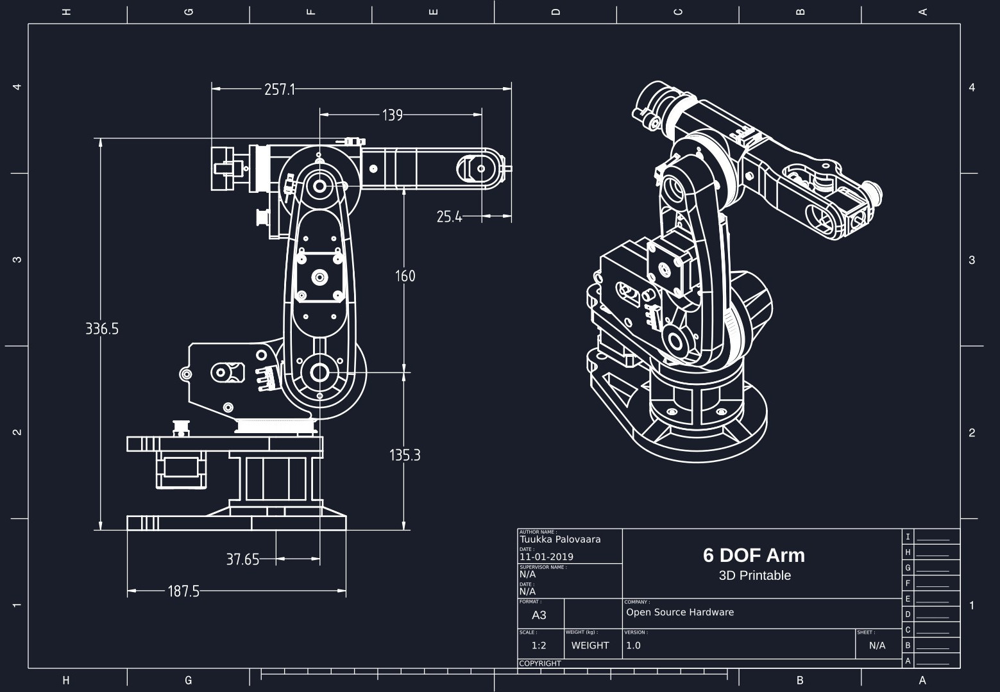
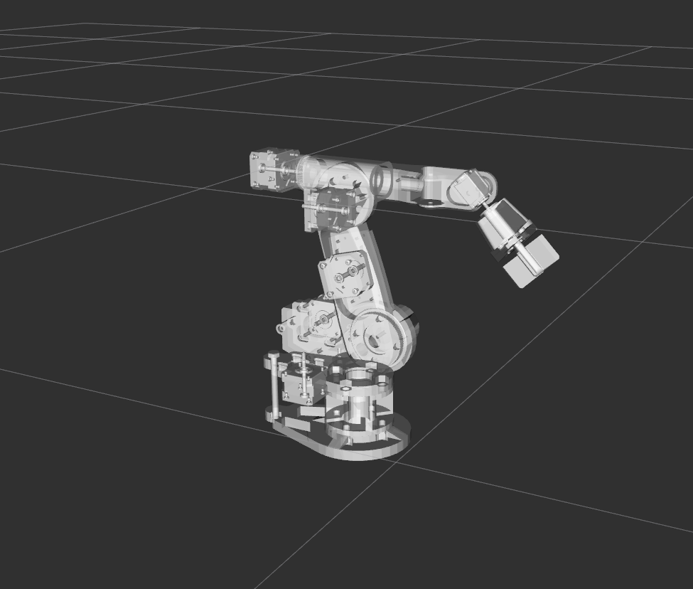

# Robot Arm Manipulator Environment

ROS2 packages for training my 6-axis robot arm (modified version of an [open-source hardware design by tw2ka](https://www.dropbox.com/scl/fi/mgowac0a7bwx7u2pcz12b/Arduino-robot-arm-files-step.zip?rlkey=3cpy6x4wcpfr1s548s7qxxex5&e=2&dl=0)) for reinforcement learning tasks.

Using ROS2 Jazzy, Jazzy control packages, and Gazebo Harmonic. 



## Quick start
Build the packages like any other ROS packages &ndash; from a workspace dir:

Create a workspace and add the packages,
```
mkdir arm_ws && cd arm_ws
git clone https://github.com/hunterwellis/Manipulator-Environment.git ./src
```
Source ROS then build and source the package,
```
source /opt/ros/jazzy/setup.bash
colcon build
source install/setup.bash
```

## arm_description
Contains robot URDF, meshes, and Gazebo launch files for the arm.



*Arm model in RViz.*

## arm_simulation
The simulation package contains the SDF world files and other files related to the Gazebo simulation environment.

To launch the arm in the gazebo environment
```
source opt/ros/jazzy/setup.bash
ros2 launch arm_simulation arm_spawn.launch.py
```


### TODO:
- inverse kinematics for end effector manipulation
- add objects for manipulation
- add camera sensor
